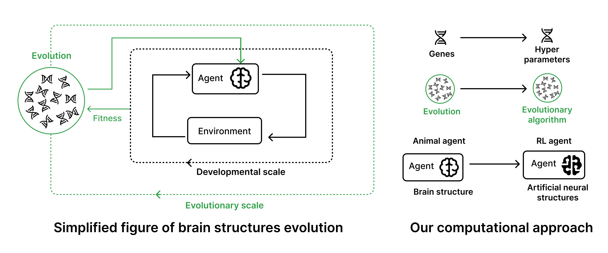

# Evolving-Reservoirs-for-Meta-Reinforcement-Learning

Evolving Reservoirs for Meta Reinforcement Learning is ... code of project. Better understand how neural structures can adapt at an evolutionary time scale, to enable agents to adapter better at a develomental scale.
==================================
* [Paper]
----
`Evolving-Reservoirs-for-Meta-Reinforcement-Learning` is a repository for ...   **Meta Reinforcement Learning** methods. We study how reservoir-like structures ... evolve at evolutionary scale to enable agents to adapt faster at a develomental scale.


Our repository provides:

* **Files to evolve one or multiple reservoirs**: Stumps Tracks and Parkour
* **Files to test evolved reservoirs** with different locomotion skills (e.g. bipedal walker, spider, climbing chimpanzee, fish)
* **Partially observable environments in Wrapper**: SAC and PPO
* **Use already existing Gymnasium or create your own**: SAC and PPO




Using this, we performed a benchmark of the previously mentioned ACL methods which can be seen in our [paper]. We also provide additional visualization on our [website].

## Installation

1- Get the repository
```
git clone https://github.com/corentinlger/Evolving-Reservoirs-for-Meta-Reinforcement-Learning.git
cd Evolving-Reservoirs-for-Meta-Reinforcement-Learning/
```
2- Install it, using Conda for example (use Python >= 3.X) Which Python version ?? 
```
venv ...
pip install requirements.txt
```


## Usage

See our [documentation] for details on how to use our platform to benchmark ACL methods.
...
### Evolve and test reservoirs on the same environment


To evolve and find the best parameters of one or many Reservoirs on specific task(s), you can use `evolve.py`. You will need to specify some parameters like in the following example : 

```
python3 evolve.py --nb_res 1 --env_id HalfCheetah-v4 --h_test test_experiment
```

We recommend using few training timesteps for the evolution part, because each RL training (dev scale) can be long ... (you can test final HPs on more timesteps). 
It is also recommended to use a parallelized approach to run the evolution experiments, for example by following this [notebook tutorial](url) to run evolutionary algorithm on parallelized jobs with a cluster of CPUs.

The results of the evolution of reservoir hyperparameters will be stored within an optuna storage. You can analyze your results with the following [notebook](url)

If you want to test your best agent, you can use the following command (make sure you provide the good parameters):

```
python3 test.py --nb_res 1 --env_id HalfCheetah-v4 --h_test test_experiment
```

### Evolve and test reservoirs on the different environments (Meta-RL setup)


To do this, go in ... and add your env_type to ... file like this (for example could be in utils or in another separate folder called multi_envs): / use existing ones 

```python
multi_envs = {["Ant-v4", "HalfCheetah-v4"],
               # Already existing envs
               ["new_env1", "new_env2"]
               }
```

To run an experiment, first evolve the reservori(s) like this : 

```
python3 evolve_multi_envs.py --nb_res 1 --env_id HalfCheetah-v4 --h_test test_experiment
```

And then test the results like this : 

```
python3 test_generalization.py --nb_res 1 --env_id HalfCheetah-v4 --h_test test_experiment
```


## Development

Should we say code isn't all cleaned and PRs are welcome if people want ?

## Citing

If you use `Evolving-Reservoirs-for-Meta-Reinforcement-Learning` in your work, please cite the accompanying [paper]:

```bibtex
@inproceedings{romac2021teachmyagent,
  author    = {Cl{\'{e}}ment Romac and
               R{\'{e}}my Portelas and
               Katja Hofmann and
               Pierre{-}Yves Oudeyer},
  title     = {TeachMyAgent: a Benchmark for Automatic Curriculum Learning in Deep
               {RL}},
  booktitle = {Proceedings of the 38th International Conference on Machine Learning,
               {ICML} 2021, 18-24 July 2021, Virtual Event},
  series    = {Proceedings of Machine Learning Research},
  volume    = {139},
  pages     = {9052--9063},
  publisher = {{PMLR}},
  year      = {2021}
}
```

[paper]: https://arxiv.org/abs/2103.09815

[Paper]: https://arxiv.org/abs/2103.09815
