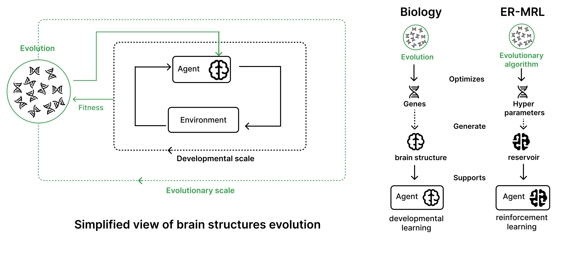

# Evolving-Reservoirs-for-Meta-Reinforcement-Learning


Code for the [`Evolving-Reservoirs-for-Meta-Reinforcement-Learning`](http://arxiv.org/abs/2312.06695) (ER-MRL) paper, presented at the [Evostar 2024](https://www.evostar.org/2024/) conference [Long Talk]. Our goal is to study the following question : How neural structures, optimized at an evolutionary scale, can enhance the capabilities of agents to learn complex tasks at a developmental scale?



To achieve this, we adopt a computational framework based on meta reinforcement learning, modeling the interplay between evolution and development. At the evolutionary scale, we evolve reservoirs, a family of recurrent neural networks generated from hyperparameters. These evolved reservoirs are then utilized to facilitate the learning of a behavioral policy through reinforcement learning. This is done by encoding the environment state through the reservoir before providing it to the agent's policy. We refer to these agents, integrating a reservoir and a policy network, as ER-MRL agents.
Our repository provides:

### Python scripts to :
- **evolve ER-MRL agents with [one](evolve_res.py) or [multiple](evolve_multi_res.py) reservoir(s) on the same environment**
- **evolve ER-MRL agents [with multiple reservoir on different environments](evolve_generalization.py) to study generalization**
- **evaluate evolved ER-MRL agents against standard RL agents with the different setups mentioned above**
- **[create your own reservoir architecture inside an ER-MRL agent or mask observations from an environment](ER_MRL/wrappers.py)**

### A tutorial to parallelize our method :
- **[run the evolution phase ER-MRL agents in parallel](parallelization_tutorials/parallelized_evolve_res.slurm)**
- **[evaluate evolved ER-MRL agents in parallel](parallelization_tutorials/parallelized_test.slurm)**

### Jupyter notebooks to :
- **[Analyze results from evolution and testing phases](results_analysis/results_analysis_notebook.ipynb)**
- **[Save the videos of agents and the inputs of their action policy](results_analysis/save_videos_observations_context.ipynb)**
- **[Plot and analyze the inputs of the trained agents](results_analysis/analyze_observations_context.ipynb)**

## Installation 

1- Get the repository

```bash
git clone https://github.com/corentinlger/ER-MRL.git
cd ER-MRL/
```
2- Install the dependencies 

```bash
python -m venv myvenv
source myvenv/bin/activate
pip install -r requirements.txt
```

## Usage

### Evolve reservoir of ER-MRL agents on the same environment


To evolve and find the best reservoir structure within an ER-MRL agent on a specific task, you can use `evolve_res.py`. See the complete list of parameters (environment choice, number of training timessteps ...) you can use while running the evolution in [this script](evolve_res.py). 

<!-- To evolve and find the best reservoir structure within an ER-MRL agent on a specific task, you can use `evolve_res.py`. You will need to specify some parameters such as the environment you want to use, the name of the experiment, the number of training timesteps ... (you can take a look at the complete list of argument in [this script](evolve_res.py)) :  -->

```bash
python3 evolve_res.py --env_id HalfCheetah-v4 --h_test test_experiment --training_steps 300000 --nb_trials 100 --sampler Cmaes
```

We recommend runing these evolution phases on a remote cluster because they can rapidly become computanionally expensive. To do so, you can follow the tutorials present in the [parallelization tutorials directory](parallelization_tutorials/).

### Test ER-MRL agents equipped with the best evolved reservoir

If you want to test the best evolved ER-MRL agent against standard RL agents, you can use the following command (make sure you provide the parameters corresponding to the ones used in the evolution phase):

```bash
python3 test.py --env_id HalfCheetah-v4 --h_test test_experiment --HP_training_steps 300000
```

### Analyze the results

To analyze the results obtained both during the evolution and the testing phases, you can follow the the steps described in [this jupyter notebook](results_analysis/results_analysis_notebook.ipynb).

<!-- After running both of these files, you may wish to analyze the results obtained during both the evolution and testing phases. This entails observing the evolution of the reservoir hyperparameters, as well as evaluating the mean and standard deviation performance of the best ER-MRL agents compared to classical RL agents. The outcomes of these experiments have been stored in Optuna journal logs and tensorboard logs, which can be easily visualized and analyzed with [this kind of notebook](results_analysis/results_analysis_notebook.ipynb). -->

### Use a multi-reservoirs setup

If you want to evolve agents containing multiple reservoirs instead of one, use the `evolve_multi_res.py` to run the evolution, and `test_multi_res.py` to test the evolved agents performance (you will need to specify the number of reservoirs desired).

### Study generalization of neural structures by evolving reservoirs of ER-MRL agents on different environments

To evolve the reservoirs of ER-MRL agents on a diversity of environments and test them on unseen ones during the evolution phase, you can run the following command:

```bash
python3 evolve_generalization.py --nb_res 2 --env_type Ant_Swimmer --h_test generalization_test_experiment --training_timesteps 300000 --nb_trials 100 --sampler Cmaes
```

You can either use a predefined set of evolution environments (the one above includes Ant-v4 and Swimmer-v4), or go in [this file](ER_MRL/experiments.py) and add a custom `env_type` to the ```generate_env_ids``` function.


### Test ER-MRL agents with evolved reservoirs on new unseen tasks

And then test the evolved ER-MRL agents on a new unseen environment (HalfCheetah-v4 in this case) as follows : 

```bash
python3 test_generalization.py --nb_res 2 --HP_env_type Ant_Swimmer --env_id HalfCheetah-v4 --h_test generalization_test_experiment
```

### Citing

```bibtex
@inproceedings{leger2024evolving,
  title={Evolving Reservoirs for Meta Reinforcement Learning},
  author={L{\'e}ger, Corentin and Hamon, Gautier and Nisioti, Eleni and Hinaut, Xavier and Moulin-Frier, Cl{\'e}ment},
  booktitle={International Conference on the Applications of Evolutionary Computation (Part of EvoStar)},
  pages={36--60},
  year={2024},
  organization={Springer}
}
 ```
